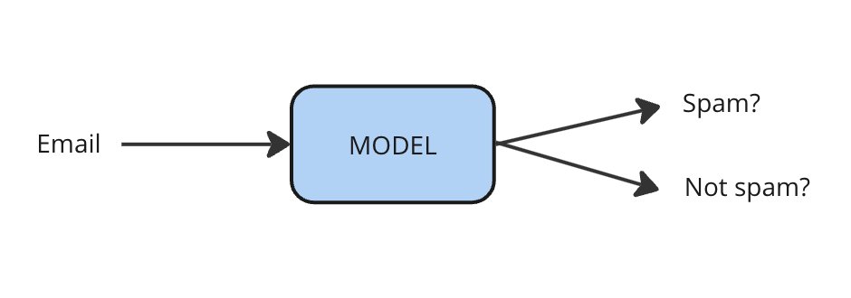

# Supervised Learning

## Learning Objectives

This section will help you understand:

- What supervised learning is, and where you can use it
- The difference between classification and regression
- Some real-world examples of supervised learning in research

## What is supervised learning?

Supervised learning is one of the most widely used types of machine learning. Supervised models predict an output for a given input. Our job is to define what the input and output are, and train the model to do a good job at the prediction. 

{ align=center }

In supervised learning, models are trained on a dataset that's been labelled with the labels that you would like the model to predict. One example is of spam email detection, where we would like to predict whether an email is spam or not.

{ align=center }

Supervised learning can either be **classification** or **regression**.

**Classification** is where the output is one of a fixed number of categories. This could be a binary classification task where there are exactly two possible outputs, like the example of spam email. There could be multiple categories, likerecognising the person in an image, like your phone might do. Even more, in some scenarios, an input might have multiple output labels, which is called _multi-label classification_, e.g. an image might have multiple people in it.  

**Regression** is where the output is a continuous number rather than a discrete class. Examples might be...

Other examples of supervised learning tasks include:

| Task | Input | Output |
| ---- | ----- | ------ |
| Automated transcription | Audio files | Written transcription |
| Machine translation | Text in the source language | Text in the target language |

Inputs here are also known as _features_. Outputs are labels, or predictions. 

## Top Tips for getting started

1. Think carefully about the task you want to work with; can you define your task as a supervised learning one? What are the inputs and outputs of your model?
2. Next, think about the data you have. Can you label it easily?
3. Think carefully about how to evaluate whether your system is working. What metrics could you use?
4. What are the risks and ethical concerns with your proposed work?

Once you've answered these questions, you're ready to move onto training a model.

## Inspiration

Find more examples of research that's using supervised learning on Accelerate's blog:

- link
- link
- link

## Contact

If you can't find what you need

[CONTACT US :fontawesome-solid-paper-plane:](mailto:accelerate-mle@cst.cam.ac.uk){ .md-button }

